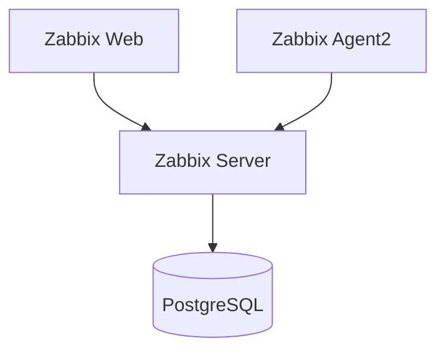
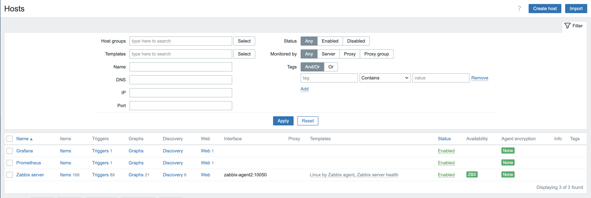

# Zabbix Lab

A production-style monitoring laboratory built with Docker Compose.

This project provides a fully containerized Zabbix environment consisting of Zabbix Server, Zabbix Web Interface, PostgreSQL Database, and Zabbix Agent2 connected through a shared monitoring network.

The lab is designed for learning, testing monitoring concepts, experimenting with Zabbix features, and integrating with external systems such as Prometheus, Grafana, Alertmanager, and Jenkins.

---

## Architecture



---

## Components

### PostgreSQL

Persistent storage for:

- Hosts
- Templates
- Triggers
- Users
- Dashboards
- Web Scenarios
- Historical monitoring data

### Zabbix Server

Responsible for:

- Data collection
- Trigger evaluation
- Alert processing
- API operations

### Zabbix Web

Web-based administration interface.

### Zabbix Agent2

Provides active and passive monitoring checks.

---

## Features

- Docker Compose deployment
- Persistent PostgreSQL storage
- Shared monitoring network
- Zabbix Agent2 integration
- API-ready environment
- Production-style architecture
- Reproducible lab environment

---

## Project Structure

```text
zabbix-lab/
├── docker-compose.yml
├── README.md
├── .gitignore
│
├── docs/
├── examples/
├── screenshots/
├── scripts/
│
└── postgres/
```

---

## Shared Monitoring Network

This lab uses a shared Docker network:

```text
monitoring-lab_default
```

The network allows communication between:

- Zabbix
- Prometheus
- Grafana
- Alertmanager
- Jenkins
- Demo Applications

### Create network (first time only)

If the network does not exist:

```bash
docker network create monitoring-lab_default
```

Verify:

```bash
docker network ls
```

> If you are using the monitoring-lab project, the network is created automatically by Docker Compose. In that case, zabbix-lab simply connects to the existing network as an external network.

---

## Deployment

Clone repository:

```bash
git clone https://github.com/DVanyan/zabbix-lab.git
cd zabbix-lab
```

Start services:

```bash
docker compose up -d
```

Verify containers:

```bash
docker ps
```

Check logs:

```bash
docker logs zabbix-server
docker logs zabbix-web
```

---

## Access

Zabbix Web UI:

```text
http://localhost:8081
```

Default credentials:

```text
Username: Admin
Password: zabbix
```

---

## Persistence

PostgreSQL data is stored locally:

```text
postgres/data/
```

This directory is excluded from Git and survives container recreation.

---

## Monitoring Targets

This laboratory is intended to monitor:

- Zabbix Agent2
- Prometheus
- Grafana
- Alertmanager
- Demo Applications
- Future Docker workloads

Monitoring methods include:

- Agent checks
- Web Scenarios
- HTTP health checks
- Trigger-based alerting

---

## Screenshots

### Dashboard


### Hosts



---

## Future Improvements

- Jenkins integration
- Zabbix API automation
- Automated host provisioning
- Automated web scenario creation
- Docker monitoring
- Prometheus health checks
- Grafana health checks
- Terraform deployment
- Ansible automation

---

## Related Projects

- Monitoring Lab (Prometheus + Grafana + Alertmanager)
- Prometheus Demo App
- Jenkins Lab
- Future Terraform Lab

---

## Author

**David Vanyan**

LFCS Certified Linux Administrator

GitHub: https://github.com/DVanyan

LinkedIn: https://www.linkedin.com/in/davidvanyan

[](https://www.credly.com/badges/eb28bbcb-1a81-4e01-98bf-b6d1e6c674be/public_url)
