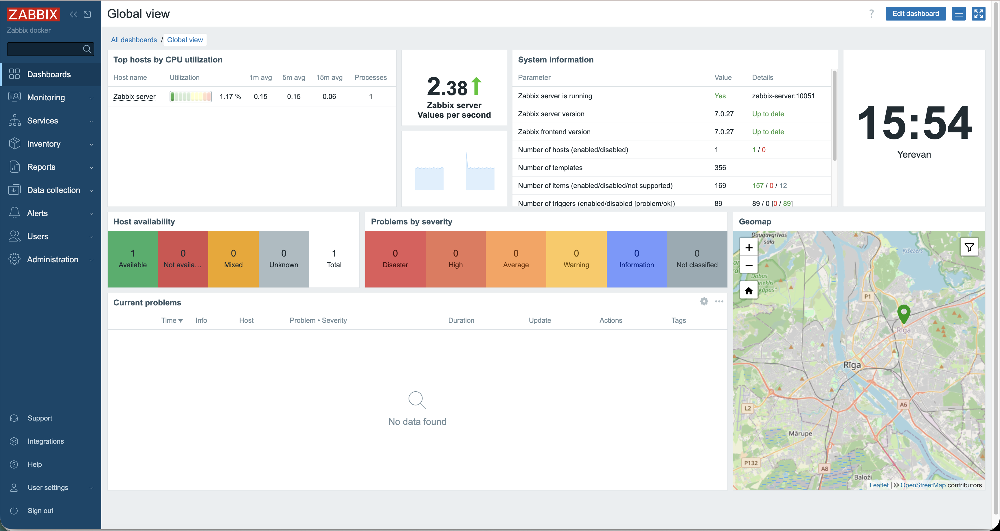

# Zabbix Lab

## Dashboard



A production-style Zabbix monitoring laboratory built with Docker Compose.

This project provides a fully containerized Zabbix environment consisting of:

- Zabbix Server
- Zabbix Web Interface
- PostgreSQL Database
- Zabbix Agent2

The lab is designed for learning, testing monitoring concepts, experimenting with Zabbix features, and integrating with external monitoring tools such as Prometheus, Grafana, and Jenkins.

---

## Architecture

```text
                 +----------------+
                 |   Zabbix Web   |
                 +--------+-------+
                          |
                          |
                 +--------v-------+
                 | Zabbix Server  |
                 +--------+-------+
                          |
                          |
                 +--------v-------+
                 | PostgreSQL DB  |
                 +----------------+
                          |
                          |
                 +--------v-------+
                 | Zabbix Agent2  |
                 +----------------+
```
---

## Components

### PostgreSQL

Persistent storage for:

- Hosts
- Templates
- Triggers
- Users
- Dashboards
- Web Scenarios
- Historical monitoring data

### Zabbix Server

Responsible for:

- Data collection
- Trigger evaluation
- Alert processing
- API operations

### Zabbix Web

Web-based administration interface.

### Zabbix Agent2

Provides active and passive monitoring checks.

---

## Features

- Docker Compose deployment
- Persistent PostgreSQL storage
- Shared monitoring network
- Zabbix Agent2 integration
- API-ready environment
- Prometheus integration ready
- Grafana integration ready
- Jenkins integration ready

---

## Project Structure

text zabbix-lab/ ├── docker-compose.yml ├── README.md ├── .gitignore │ ├── docs/ ├── examples/ ├── screenshots/ ├── scripts/ │ └── postgres/ 

---

## Network Configuration

This lab uses a shared Docker network:

text monitoring-lab_default 

The network allows communication between:

- Zabbix
- Prometheus
- Grafana
- Alertmanager
- Jenkins
- Demo Applications

If the network does not exist, create it before deployment:

bash docker network create monitoring-lab_default 

Verify:

bash docker network ls 

---

## Deployment

Clone repository:

bash git clone https://github.com/DVanyan/zabbix-lab.git cd zabbix-lab 

Start services:

bash docker compose up -d 

Verify:

bash docker ps 

Check logs:

bash docker logs zabbix-server docker logs zabbix-web 

---

## Access

Zabbix Web UI:

text http://localhost:8081 

Default credentials:

text Username: Admin Password: zabbix 

---

## Persistence

PostgreSQL data is stored locally:

text postgres/data/ 

This directory is excluded from Git and survives container recreation.

---

## Screenshots

Screenshots will be added after completing the initial monitoring configuration.

---

## Future Improvements

- Jenkins integration
- Zabbix API automation
- Automated host provisioning
- Automated web scenario creation
- Prometheus health checks
- Grafana health checks
- Docker monitoring
- Terraform deployment
- Ansible automation

---

## Author

David Vanyan

LFCS Certified Linux Administrator

GitHub: https://github.com/DVanyan

LinkedIn: https://www.linkedin.com/in/davidvanyan
